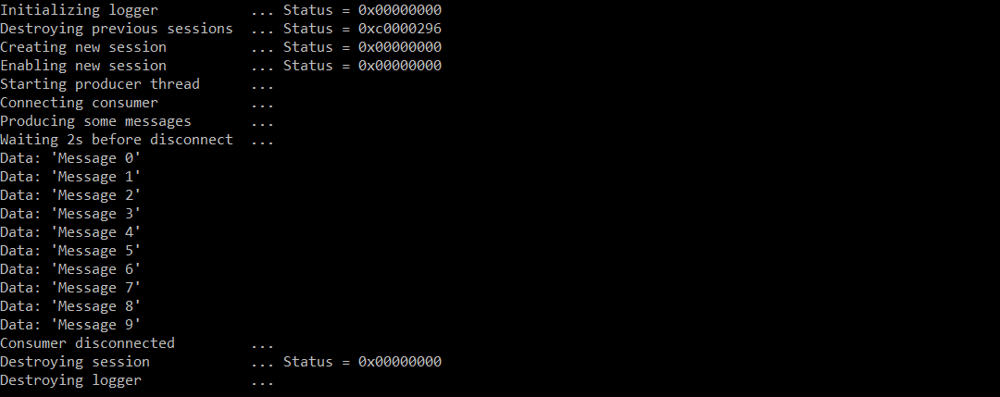

# EtwConsumerNT

EtwConsumerNT is a simple project that demonstrates how an **ETW consumer** can
be created just by using NTDLL.

### Why?

Because I couldn't find such thing. My goal was to understand how functions like
`StartTrace`, `OpenTrace`, `EnableTrace` and `ProcessTrace` work internally.

There are some references to the `NtTraceControl` API, like this
[exploit][nttracecontrol-exploit] for example, but nothing much beyond that.

Last but not least, this project can be helpful if you're thinking about fuzzing
the `NtTraceControl` API, because as you'll see later, this function exposes quite
big attack surface.

### What does it do?

It starts an **ETW real-time consumer** in main thread and **ETW producer** in
another thread. The producer creates 10 messages, which should be received by
the consumer. After that, the consumer is disconnected and the application exits.
The output might look like this:



### Implementation

As you've probably guessed from the previous paragraph, the core of the ETW consumer
is the undocumented `NtTraceControl` API:

```c
NTSYSCALLAPI
NTSTATUS
NTAPI
NtTraceControl(
    _In_ ULONG FunctionCode,
    _In_reads_bytes_opt_(InBufferLen) PVOID InBuffer,
    _In_ ULONG InBufferLen,
    _Out_writes_bytes_opt_(OutBufferLen) PVOID OutBuffer,
    _In_ ULONG OutBufferLen,
    _Out_ PULONG ReturnLength
    );
```

The prototype of this function can remind you of the `NtDeviceIoControlFile`
function prototype - and it makes sense, since ETW (previously WMI) has been initially
implemented as a device (`WMIAdminDevice` & `WMIDataDevice`).

On Windows 10 RS5, the `FunctionCode` parameter can be one of these values:

```c
typedef enum _ETW_FUNCTION_CODE
{
  EtwFunctionStartTrace = 1,
  EtwFunctionStopTrace = 2,
  EtwFunctionQueryTrace = 3,
  EtwFunctionUpdateTrace = 4,
  EtwFunctionFlushTrace = 5,
  EtwFunctionIncrementTraceFile = 6,

  EtwFunctionRealtimeConnect = 11,
  EtwFunctionWdiDispatchControl = 13,
  EtwFunctionRealtimeDisconnectConsumerByHandle = 14,
  EtwFunctionReceiveNotification = 16,
  EtwFunctionTraceEnableGuid = 17, // EtwTraceNotifyGuid
  EtwFunctionSendReplyDataBlock = 18,
  EtwFunctionReceiveReplyDataBlock = 19,
  EtwFunctionWdiUpdateSem = 20,
  EtwFunctionGetTraceGuidList = 21,
  EtwFunctionGetTraceGuidInfo = 22,
  EtwFunctionEnumerateTraceGuids = 23,
  EtwFunctionQueryReferenceTime = 25,
  EtwFunctionTrackProviderBinary = 26,
  EtwFunctionAddNotificationEvent = 27,
  EtwFunctionUpdateDisallowList = 28,
  EtwFunctionUseDescriptorTypeUm = 31,
  EtwFunctionGetTraceGroupList = 32,
  EtwFunctionGetTraceGroupInfo = 33,
  EtwFunctionGetDisallowList = 34,
  EtwFunctionSetCompressionSettings = 35,
  EtwFunctionGetCompressionSettings = 36,
  EtwFunctionUpdatePeriodicCaptureState = 37,
  EtwFunctionGetPrivateSessionTraceHandle = 38,
  EtwFunctionRegisterPrivateSession = 39,
  EtwFunctionQuerySessionDemuxObject = 40,
  EtwFunctionSetProviderBinaryTracking = 41,
} ETW_FUNCTION_CODE;
```

Some notes:
- This `enum` isn't present in any PDB. It has been manually reconstructed by
  decompiling `ntoskrnl!NtTraceControl` function.
- Other Windows versions can have completely different set of function codes.
- Although this project has been developed on Windows 10 RS5, quick test revealed
  that it **also works on Windows 7 (both x86 & x64)**.
    - ... but on Windows 7, printing to the console does not work for some reason.
    - If anyone figures out an easy way how to print to console just by using NTDLL
      on Windows 7, I'd be more than happy to accept a pull request.
- If you're brave enough, I believe **it should be possible to create ETW consumer
  purely in the Windows Driver**.
- For simplicity, there aren't many error checks.
- The buffers can arrive in different order - **the correct ordering of messages
  across buffers isn't implemented here**.
    - ... neither is correct handling of timestamps.
- This project relies on undocumented structures, so, please think twice
  before shipping this into production.

### Points of interest

- `sechost.dll!StartTraceW`
- `sechost.dll!StopTraceW`
- `sechost.dll!OpenTraceW`
- `sechost.dll!EnableTraceEx2`
- `sechost.dll!ProcessTrace`
- `sechost.dll!EtwpProcessRealTimeTraces`
- `ntoskrnl!NtTraceControl`

### License

This software is open-source under the MIT license. See the LICENSE.txt file in this repository.

Dependencies are licensed by their own licenses.

If you find this project interesting, you can buy me a coffee

```
  BTC 12hwTTPYDbkVqsfpGjrsVa7WpShvQn24ro
  LTC LLDVqnBEMS8Tv7ZF1otcy56HDhkXVVFJDH
```

[nttracecontrol-exploit]: <https://www.exploit-db.com/exploits/42007>
